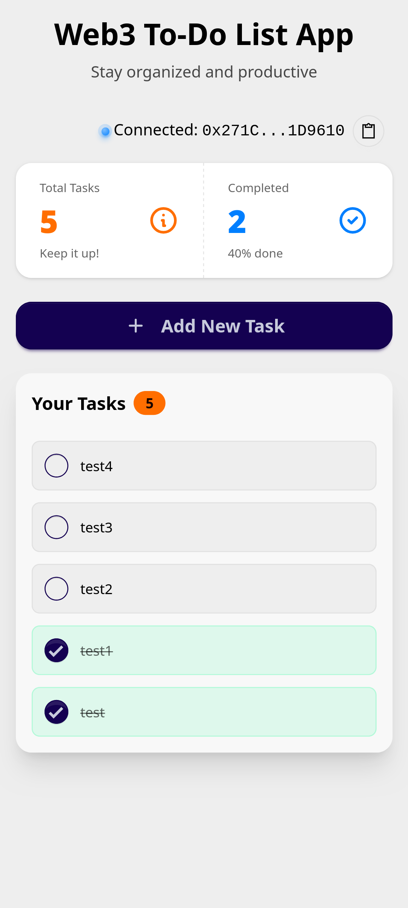
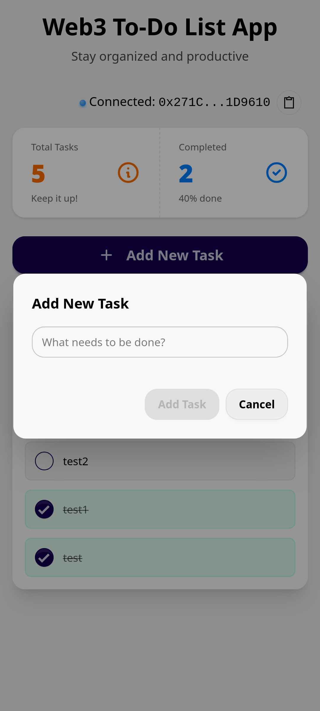
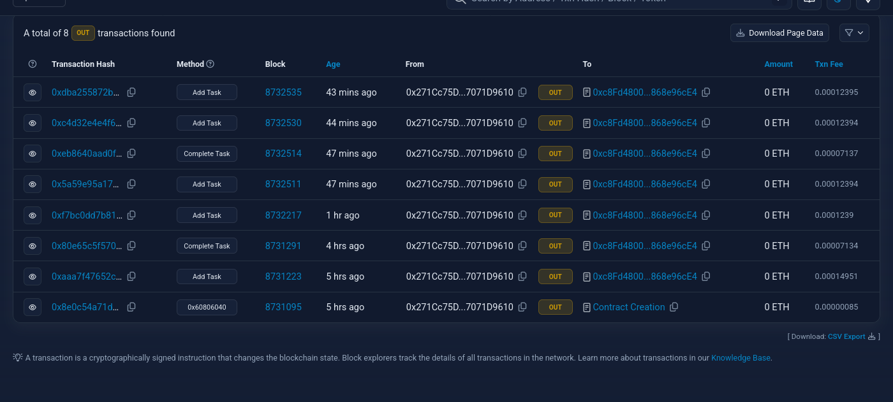

# 🧾 Web3 To-Do List DApp

A decentralized task manager built with Solidity, React, and MetaMask. Tasks are stored on-chain using Ethereum testnet.

## 🔧 Features

- Connect wallet via MetaMask
- Add tasks to the blockchain
- Mark tasks as complete
- View all tasks in real-time

## 🛠 Technologies Used

| Layer | Tech |
|-------|------|
| Blockchain | Ethereum (Sepolia Testnet) |
| Smart Contract | Solidity, Hardhat |
| Frontend | React.js, daisyUI |
| Wallet | MetaMask |
| Web3 Provider | Ethers.js |

## 🪢 Transactions Created (sepolia.etherscan.io)

